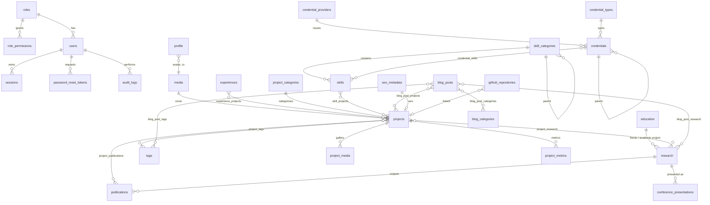

# Database

PostgreSQL 16 is the single source of truth. The schema is defined in
TypeScript with Drizzle ORM (`apps/api/src/database/schema/`) and every change
ships as a reviewed SQL migration in `apps/api/src/database/migrations/`.

## Principles

- **Relational first.** Entities, relations and taxonomies are tables with
  foreign keys. JSONB is used only for genuinely flexible, presentation-level
  content: content blocks (`sections`, `body`), experience metrics and GitHub
  language breakdowns. Ordered string lists (responsibilities, keywords,
  technologies) use `text[]` with GIN indexes where they are filtered.
- **Integrity in the database.** Foreign keys with explicit `ON DELETE`
  behaviour, `CHECK` constraints for invariants (a current role has no end date,
  end ≥ start, slug format, singleton rows), unique indexes for slugs and natural
  keys. Media referenced by content uses `ON DELETE RESTRICT` so a file in use
  cannot be deleted by accident.
- **UUID keys, slug URLs.** Primary keys are `uuid` (`gen_random_uuid()`); public
  URLs use unique slugs. `analytics_events` uses a `bigint` identity for volume.
- **Timestamps.** `created_at`/`updated_at` are `timestamptz`. Career-style dates
  (`date`) are stored as the first of the month and displayed at month precision.
- **Search.** Projects, research, publications and posts carry a generated,
  weighted `tsvector` column (title A, summary B, body text C) with a GIN index.

## Entity overview

## Tables

### Identity and administration

| Table                   | Purpose                             | Key columns / constraints                                                                                     |
| ----------------------- | ----------------------------------- | ------------------------------------------------------------------------------------------------------------- |
| `roles`                 | Named roles (ADMIN, EDITOR, custom) | `key` unique, `is_system` protects built-ins                                                                  |
| `role_permissions`      | Permission keys granted to a role   | PK (`role_id`, `permission`); keys defined in `packages/shared/src/permissions.ts`                            |
| `users`                 | Admin/editor accounts               | unique `lower(email)`, Argon2id `password_hash`, `status` (active/disabled), lockout counters                 |
| `sessions`              | Server-side sessions                | PK = SHA-256 of the cookie token (raw token never stored), `csrf_token`, absolute + idle expiry, `revoked_at` |
| `password_reset_tokens` | One-time reset tokens               | `token_hash` unique, `expires_at`, `used_at`                                                                  |
| `audit_logs`            | Record of administrative actions    | actor, action, entity type/id, summary, `previous_value`/`new_value` JSONB (secrets removed)                  |

### Profile and site

| Table              | Purpose                                                                                                                               |
| ------------------ | ------------------------------------------------------------------------------------------------------------------------------------- |
| `profile`          | Singleton (`id = 1`): name, headline, statement, intro, bio, philosophy, research interests, location, public email, avatar, CV media |
| `social_links`     | Ordered, show/hide links (GitHub, LinkedIn, email, Scholar, ORCID…)                                                                   |
| `focus_areas`      | "What I work on" entries for the home page                                                                                            |
| `approach_steps`   | The Statistics → … → Impact pipeline, each with evidence text                                                                         |
| `site_settings`    | Singleton: site name, description, default OG image, contact/analytics/GitHub settings                                                |
| `navigation_items` | Header/footer navigation, ordered, show/hide                                                                                          |
| `seo_metadata`     | SEO overrides; `route_key` for static pages, referenced by content via `seo_id`                                                       |

### Career

| Table                 | Notes                                                                                                                                                                                                                                      |
| --------------------- | ------------------------------------------------------------------------------------------------------------------------------------------------------------------------------------------------------------------------------------------ |
| `experiences`         | Company, logo, position, department, employment type, location, start/end, `is_current` (CHECK: current ⇒ no end date), summary, responsibilities[], achievements[], technologies[], domains[], metrics JSONB, featured, order, visibility |
| `experience_projects` | Related projects                                                                                                                                                                                                                           |
| `education`           | Institution, degree, field, dates, grade value/scale, project title, description, courses[], order, visibility                                                                                                                             |

### Projects

| Table                                                                                          | Notes                                                                                                                                                                                                                                                                  |
| ---------------------------------------------------------------------------------------------- | ---------------------------------------------------------------------------------------------------------------------------------------------------------------------------------------------------------------------------------------------------------------------- |
| `project_categories`                                                                           | Admin-defined categories                                                                                                                                                                                                                                               |
| `tags`                                                                                         | Shared tag vocabulary (projects and posts)                                                                                                                                                                                                                             |
| `projects`                                                                                     | Title, slug, summary, type (professional/research/personal/academic), category, role, organisation, dates, technologies[], links, cover, `sections` JSONB (case-study sections → content blocks), status/visibility/featured/order, `published_at`, SEO, search vector |
| `project_tags`, `project_media`, `project_metrics`, `project_research`, `project_publications` | Tags, gallery (kind/caption/order), headline metrics, related research and publications                                                                                                                                                                                |

### Research

| Table                      | Notes                                                                                                                                                                                                                                                                                                                                                |
| -------------------------- | ---------------------------------------------------------------------------------------------------------------------------------------------------------------------------------------------------------------------------------------------------------------------------------------------------------------------------------------------------- |
| `research`                 | Kind (thesis, academic project, research project, working paper, report), abstract, research question, `sections` JSONB (data, methodology, statistical methods, models, findings, limitations), keywords[], methods[], degree/institution/supervisor, `education_id`, PDF/poster/slides media, status/visibility/featured/order, SEO, search vector |
| `publications`             | Authors[], venue, volume/issue/pages, publisher, publication date, DOI, URL, PDF, abstract, keywords[], methodology, findings, citation/BibTeX overrides, publication status (published/accepted/…/preprint), type, `research_id`                                                                                                                    |
| `conference_presentations` | Conference name/short name/edition, location, date, presentation type (poster/oral/…), title, abstract, poster/slides media, event URL, `research_id`                                                                                                                                                                                                |

### Skills and credentials

| Table                  | Notes                                                                                                                                                                                                                                                                                                                          |
| ---------------------- | ------------------------------------------------------------------------------------------------------------------------------------------------------------------------------------------------------------------------------------------------------------------------------------------------------------------------------ |
| `skill_categories`     | Self-referencing tree (`parent_id`), arbitrary depth                                                                                                                                                                                                                                                                           |
| `skills`               | Category, description, optional qualitative level, years, icon key, technologies[], featured/order/visibility; unique (`category_id`, `slug`)                                                                                                                                                                                  |
| `skill_projects`       | Related projects                                                                                                                                                                                                                                                                                                               |
| `credential_providers` | Issuing organisations (Coursera, DataCamp, … — data, not code)                                                                                                                                                                                                                                                                 |
| `credential_types`     | Admin-defined node types (Specialization, Track, Course, Certificate, Workshop, …)                                                                                                                                                                                                                                             |
| `credentials`          | Tree of credential nodes: provider, `parent_id`, type, title, slug, level, description, issue/expiry dates, credential ID/URL, verification URL, image, PDF, related project, featured/order/visibility. Composite FK (`parent_id`, `provider_id`) → (`id`, `provider_id`) guarantees a child belongs to its parent's provider |
| `credential_skills`    | Skills evidenced by a credential                                                                                                                                                                                                                                                                                               |

### Blog

`blog_categories`, `blog_posts` (title, slug, excerpt, cover, `body` JSONB
blocks, author, status/visibility/featured, `published_at`, reading time, SEO,
search vector), and join tables `blog_post_categories`, `blog_post_tags`,
`blog_post_projects`, `blog_post_research`.

### Media, contact, analytics, integrations

| Table                 | Notes                                                                                                                                       |
| --------------------- | ------------------------------------------------------------------------------------------------------------------------------------------- |
| `media`               | Random `storage_key`, original name, MIME type, kind, size, dimensions, SHA-256, alt text, caption, title, uploader                         |
| `contact_messages`    | Name, email, subject, message, status (new/read/replied/archived/spam), salted IP hash, timestamps                                          |
| `analytics_events`    | Event type, path, entity, referrer host, device category, browser, OS, country (optional), daily-rotating visitor hash — no IPs, no cookies |
| `analytics_salts`     | One random salt per day; deleted after two days so visitor hashes cannot be reversed                                                        |
| `github_repositories` | Cached repository metadata, curation (`is_selected`, order, custom description, linked project)                                             |
| `integration_status`  | Last run / success / error per integration                                                                                                  |

## Migrations

- Change the schema in `apps/api/src/database/schema/*.ts`.
- Generate SQL: `npm run db:generate -- --name <change>`; review the SQL.
- Apply: `npm run db:migrate` (also run by the `migrate` service in Docker).
- Never edit a migration that has been applied anywhere; add a new one.
- Destructive changes (dropping columns/tables) need a two-step migration:
  stop using the column, deploy, then drop it.

## Seed data

`npm run db:seed` is idempotent (upserts by natural keys). It seeds roles and
permissions, the first admin account (from `SEED_ADMIN_*` variables), and
portfolio content supported by the CV or explicitly provided by the owner —
see `content-model.md` for the exact list. Unknown facts (for example the IDLC
start date, research findings, credential IDs) are left empty and editable.

## Backups

See `deployment.md#backups` for `pg_dump` scheduling, retention and the restore
drill.
